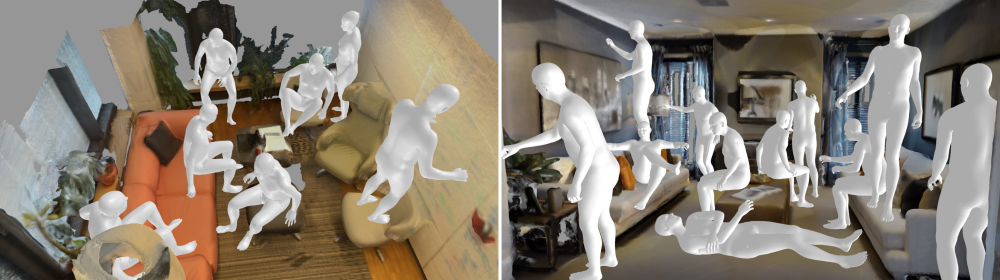
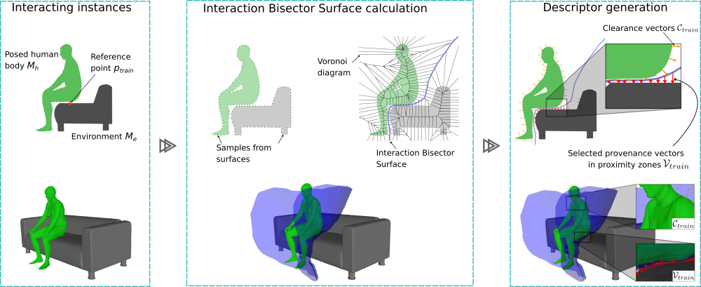

# AROS
Official implementation for paper  "AROS: Affordance Recognition with One-Shot Human Stances"

Install conda environment with 

conda env create -f aros_calculation.yml

### aros_calulations.py

Calculates the clearance of a provided interactions "sitting"

